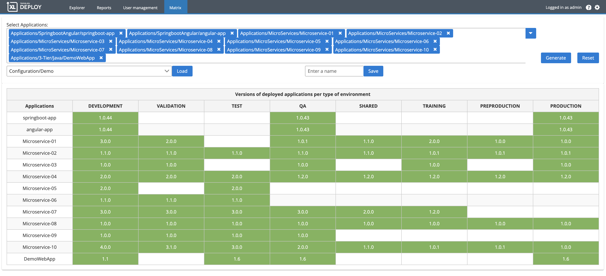

# XL Deploy Matrix plugin v1.0.0

[![Build Status][matrix-travis-image]][matrix-travis-url]
[![License: MIT][matrix-license-image]][matrix-license-url]
![Github All Releases][matrix-downloads-image]

[matrix-travis-image]: https://travis-ci.org/xebialabs-community/xld-matrix-plugin.svg?branch=master
[matrix-travis-url]: https://travis-ci.org/xebialabs-community/xld-matrix-plugin
[matrix-license-image]: https://img.shields.io/badge/License-MIT-yellow.svg
[matrix-license-url]: https://opensource.org/licenses/MIT
[matrix-downloads-image]: https://img.shields.io/github/downloads/xebialabs-community/xld-matrix-plugin/total.svg

## Preface

This document describes the functionality provided by the XL Deploy Matrix plugin.

See the [XL Deploy reference manual](https://docs.xebialabs.com/xl-deploy) for background information on XL Deploy and deployment automation concepts.  

## Overview

The XL Deploy Matrix extension enables you to know which versions of applications are deployed. 

## Requirements

Tested only on XL Deploy version 9.5. Should work on previous versions.

Note:  XLD version should not be lower than lowest supported version.  See <https://support.xebialabs.com/hc/en-us/articles/115003299946-Supported-XebiaLabs-product-versions>.

## Installation

* Copy the latest JAR file from the [releases page](https://github.com/xebialabs-community/matrix/releases) into the `XL_DEPLOY/plugins` directory.
* Restart the XL Deploy server.

## Configuration

Three new items are available in the Configuration section in the matrix menu:

- category

A category is used to categorize an environment. Just set a name, then associate a category to the environment you want to be displayed in the report.

The category name is used for the header of the report.

- configuration

A configuration is used to order categories (see previous point).
As per version 1.0.0, create only one configuration (only the first configuration item will be used.)

- applicationSet

An applicationSet is a component that keep several applications as one configuration component. You normally do not create applicationSet manually. An applicationSet is created when you use the "save" button in the Matrix report.

## Usage

The Matrix report is available in the "Matrix" tab.

- Select applications using the dropdown select.
- Press the "Generate" button to build the report.
- You can save your configuration: enter a name and press the "Save" button.
- To load a configfuration, select one and press the "Load" button.
- The "Reset" button clear all selections.

